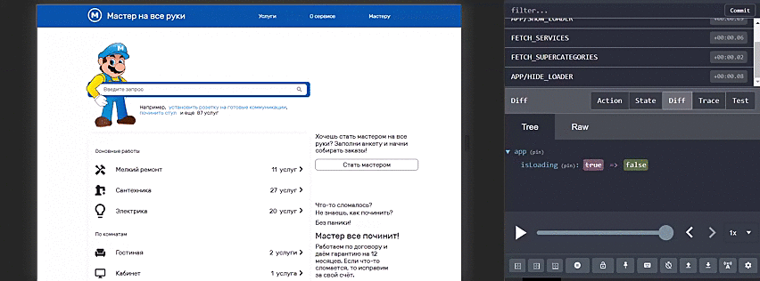

<h1 align="center">MasterHands</h1>
<h2 align="center">
  
</h2>
  
Our stack
-----------
SSR изоморфное приложение в связке NGINX + Django + Express.js + React.js + PostgreSQL

## Project setup

```
git clone https://github.com/kstdbrv/MasterHands.git

python -m venv venv
pip install -r .\requirements.txt

cd MasterHands
python manage.py makemigrations
python manage.py migrate

cd ..
venv\scripts\activate
cd MasterHands
python manage.py runserver

cd frontend
npm install
npm start
```
